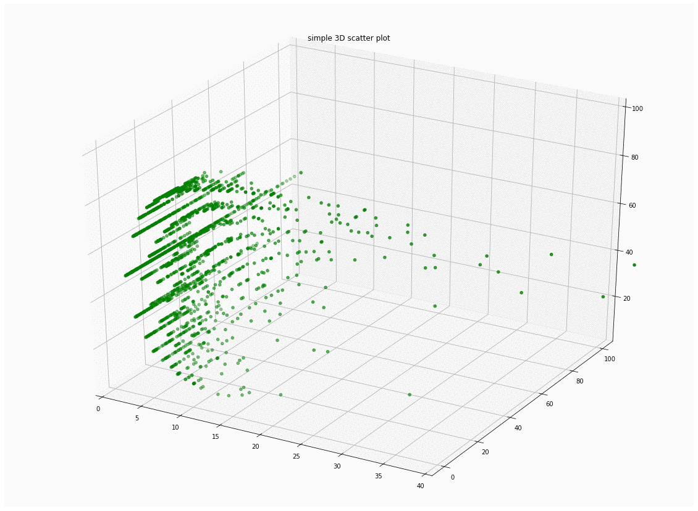

# Object Detection

The below repository explores two different architectures using separate libraries (Tensorflow and Pytorch).

## Dependencies
The repository requires Tensorflow>= 2.3.0 and Torch 1.6+ with torchvision
##

## Approach
An attempt was made to explore different object detection techniques using a supplied dataset. Initial exploration of the data revealed ~2200 images that were available for training along with ~16700 annotations for two classes: 
* Person
* Car
On further investigations, minor errors in annotations were noticed such as incorrect bbox dimensions etc. These were subsequently filtered.
The image level information was extracted and plotted in a 3D scatter chart to look at the distribution of the data.
### Data split and distribution
While usually, a random split of data is used to generate training and validation data, prior in object detection has shown that this can cause the test data to have a very different distribution (of classes and annotation properties) than training data resulting in a poor model.
Thus, an approach was designed to cluster and stratify the images using their properties (image above). This ensures that the distribution in both the datasets are similar.

To achieve the clustering, a gap statistic measure was used to first determine the optimal number of clusters before classifying each of the images into them using 3 features:
* avg_area - average area of annotation in image
* tot_annos - total no of annotations in image
* cat1_ratio -  ratio of person:car annotations in image
Once done, 80% of images from each cluster were assigned to training while the other 20% went to test.

At this point, our training and test data frames have been prepared.
## Single Stage Detector
Single stage detection is fast and trains quicker compared to two stage detectors, thus the initial attempt for object detection was with a single stage detector. The tensorflow object detection api was used for the task and the choice of architecture was a RetinaNet with Focal Loss. One of the main reasons behind choosing the focal loss was partial mitigation of the 'class imbalance issue' that SSDs face.
| iou  | threshold | AP   |
|------|-----------|------|
| 0.5  | 0.5       | 41.9 |
| 0.5  | 0.95(s)   | 22.1 |
| 0.75 | 0.5       | 12.4 |

## 2 Stage Detector
Two stage detection allows for better precision due to the region proposal network and the subsequent subnets of classification and regression. Based on the results of the SSD, the two stage detector selected was a faster_rcnn pretrained network.
Results:
| iou  | threshold | AP   |
|------|-----------|------|
| 0.5  | 0.5       | 73.9 |
| 0.5  | 0.95(s)   | 52.5 |
| 0.75 | 0.5       | 42.7 |

## Sample Results:
